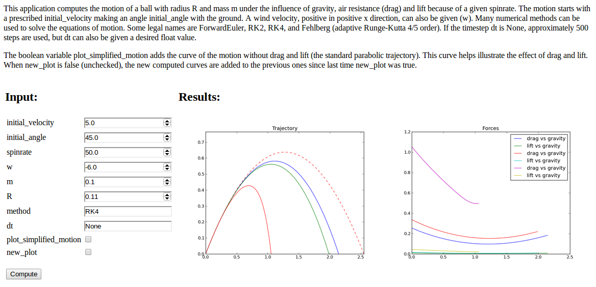

## Parampool: Handling a pool of input parameters in scientific applications

The `parampool` package is a tool for administering a pool of parameters
in scientific applications. The package contains

 * a general tree data structure in Python (subpackage `tree`),
 * an application of the tree structure to pools of input parameters
   for simulation programs (subpackage `pool`),
 * tools for automatic generation of web-based user interfaces
   (subpackage `generator`), based on a pool or just a function.

With `parampool` it is very easy to equip a scientific application with
various kinds of user interfaces: graphical via web, command line,
and file input.

### Killer demo: write your computational Python function

Here is a Python function taking some arguments, calling up computations,
and returning the results as HTML code to be displayed in a browser
(e.g., two plots and a table of results):

~~~~~~~~~~~~~~~~~~~~~~~~~~~~~~~~~~~~~~~~~~~~~~~~~~~~~~~~{.Python}
def compute_motion_and_forces0(
    initial_velocity=5.0,
    initial_angle=45.0,
    spinrate=50.0,
    w=0.0,
    m=0.1,
    R=0.11,
    method='RK4',
    dt=None,
    plot_simplified_motion=True,
    new_plot=True
    ):
~~~~~~~~~~~~~~~~~~~~~~~~~~~~~~~~~~~~~~~~~~~~~~~~~~~~~~~~~~~~~~~

Here is the Python code you need to write in order to generate a
graphical user interface in a web browser:

~~~~~~~~~~~~~~~~~~~~~~~~~~~~~~~~~~~~~~~~~~~~~~~~~~~~~~~~{.Python}
from parampool.generator.flask import generate
from compute import compute_motion_and_forces

generate(compute_motion_and_forces, MathJax=True)
~~~~~~~~~~~~~~~~~~~~~~~~~~~~~~~~~~~~~~~~~~~~~~~~~~~~~~~~~~~~~~~

The result is a [Flask](http://flask.pocoo.org/) application.
Running `python controller.py` and opening a web browser provide access
to the user interface. You can fill in values, press *Compute*, and
get results back.

<!--  -->

Replace `flask` by `django` and you get a Django-based user interface
instead (!).

### Killer demo: make a pool tree

The user interface above was based on inspecting a Python function and
its keyword arguments and default values.
To get more control of the user interface, you can specify all the
input parameters as a hierarichal tree, called *pool tree*. Here is an example:

 * Main pool
   * Initial motion data
     * Initial velocity: `initial_velocity`
     * Initial angle: `initial_angle`
     * Spinrate: `spinrate`

   * Body and environment data
     * Wind velocity: `w`
     * Mass: `m`
     * Radius: `R`

   * Numerical parameters
     * Method: `method`
     * Time step: `dt`

   * Plot parameters
     * Plot simplified motion: `plot_simplified_motion`
     * New plot: `new_plot`

In Python, this may take the form

~~~~~~~~~~~~~~~~~~~~~~~~~~~~~~~~~~~~~~~~~~~~~~~~~~~~~~~~{.Python}
def pool_definition_list():
    """Create and return pool defined through a nested list."""
    pool = [
        'Main', [
            'Initial motion data', [
                dict(name='Initial velocity', default=5.0),
                dict(name='Initial angle', default=45,
                     widget='range', minmax=[0,90], range_step=1),
                dict(name=r'Spinrate', default=50, widget='float',
                     unit='1/s'),
                ],
            'Body and environment data', [
                dict(name='Wind velocity', default=0.0,
                     help='Wind velocity in positive x direction.',
                     minmax=[-50, 50], number_step=0.5,
                     widget='float', str2type=float),
                dict(name='Mass', default=0.1, unit='kg',
                     validate=lambda data_item, value: value > 0,
                     help='Mass of body.'),
                dict(name='Radius', default=0.11, unit='m',
                     help='Radius of spherical body.'),
                ],
            'Numerical parameters', [
                dict(name='Method', default='RK4',
                     widget='select',
                     options=['RK4', 'RK2', 'ForwardEuler'],
                     help='Numerical solution method.'),
                dict(name='Time step', default=None,
                     widget='textline', unit='s'),
                ],
            'Plot parameters', [
                dict(name='Plot simplified motion', default=True,
                     help='Plot motion without drag+lift forces.'),
                dict(name='New plot', default=True,
                     help='Erase all old curves.'),
                ],
            ],
        ]
    from parampool.pool.UI import listtree2Pool
    pool = listtree2Pool(pool)
    return pool
~~~~~~~~~~~~~~~~~~~~~~~~~~~~~~~~~~~~~~~~~~~~~~~~~~~~~~~~~~~~~~~

There is more to learn when specifying a *pool* of parameters (compared to just
providing a compute function), but you also get a lot fancier
web-based graphical user interface or command-line (or file) interface.
The interfaces are automatically generated with very few lines of code.

<!--  -->

You can freely choose between a Flask or Django application for realizing the
user interface.

Read the [tutorial](http://hplgit.github.io/parampool/doc/pub/pp.html)
to learn how to use Parampool!

